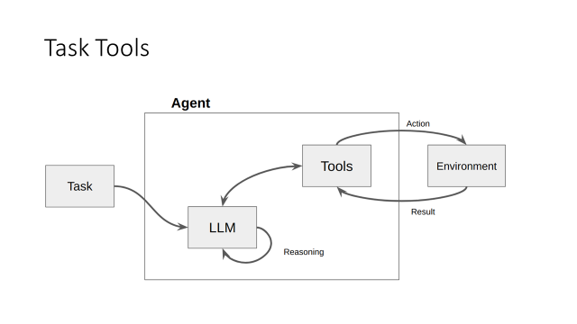
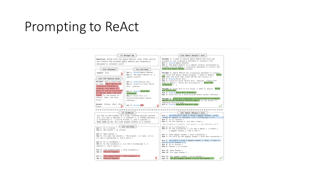
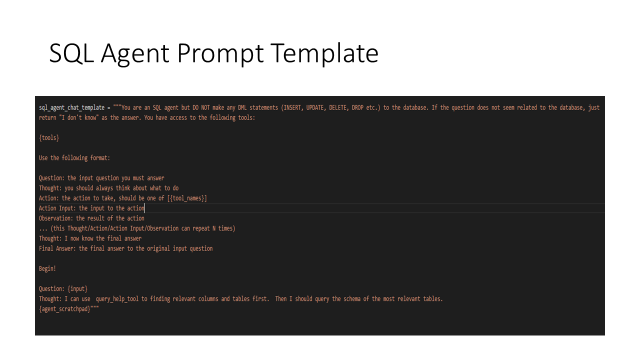

# AgenticLLM

this repo is broad strokes on learning and implementing agentic flows with LLM

conversewithSQL is text to sql implemented with #langchain framework

credits

https://medium.com/@lucnguyen_61589/understanding-the-magic-deconstructing-langchains-sql-agent-667881b9e209
https://betterprogramming.pub/building-a-custom-langchain-tool-for-generating-executing-code-fa20a3c89cfd
