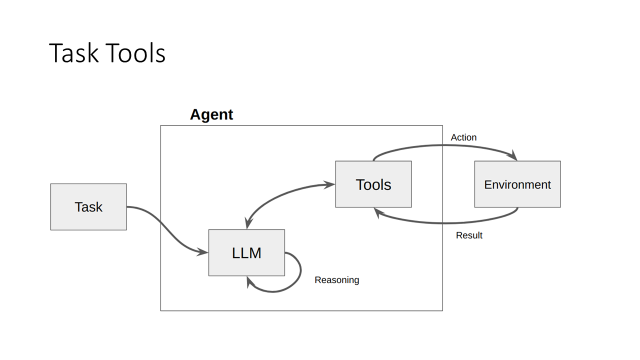
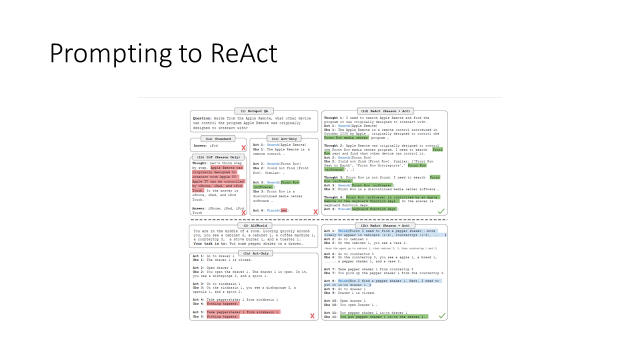
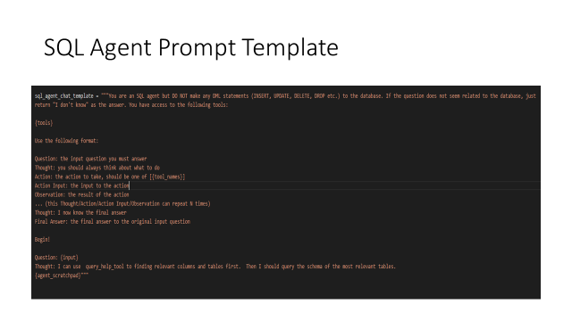

# AgenticLLM

A project for implementing and learning about agentic flows with Large Language Models (LLMs).

## Project Overview

This repository contains various implementations of agentic LLM systems, including:

- **SQL Agent**: Text-to-SQL implementation using the LangChain framework
- **Memory Agent**: Agent with memory capabilities using AWS Bedrock and LangMem
- **Google ADK Agent**: Agent implementation using Google's Agent Development Kit

## Project Structure

```
agenticllm/
├── data/                      # Data files and resources
│   ├── embedded_data/         # Embedded data files
│   └── sql_scripts/           # SQL scripts for the SQL agent
├── docs/                      # Documentation
├── notebooks/                 # Jupyter notebooks
├── src/                       # Source code
│   ├── agents/                # Agent implementations
│   │   ├── google_adk_agent/  # Google ADK agent
│   │   ├── memory_agent/      # Memory agent with AWS Bedrock
│   │   └── sql_agent/         # SQL agent
│   ├── config/                # Configuration files
│   ├── models/                # Model implementations
│   └── utils/                 # Utility functions
├── run_google_adk_agent.py    # Script to run the Google ADK agent
├── run_sql_agent.py           # Script to run the SQL agent
└── tests/                     # Test files
```

## Getting Started

### Prerequisites

- Python 3.11 (project is currently running on Python 3.11.2)
- Virtual environment (recommended)
- AWS account with Bedrock access (for Memory Agent)
- Google API key (for Google ADK Agent)
- SQL Server database (for SQL Agent)

### Installation

1. Clone the repository:
   ```
   git clone https://github.com/yourusername/agenticllm.git
   cd agenticllm
   ```

2. Create and activate a virtual environment:
   ```
   python -m venv venv
   source venv/bin/activate  # On Windows: venv\Scripts\activate
   ```

3. Install the package in development mode:
   ```
   pip install -e .
   ```

4. Install all dependencies from requirements.txt:
   ```
   pip install -r requirements.txt
   ```

5. Set up environment variables in a `.env` file:
   ```
   # SQL Agent
   DB_URL=your_database_url
   OPENAI_API_KEY=your_openai_api_key

   # Memory Agent
   MODEL_ID=anthropic.claude-3-sonnet-20240229-v1:0
   BED_ROCK_AWS_PROFILE=your_aws_profile

   # Google ADK Agent
   GOOGLE_API_KEY=your_google_api_key
   GOOGLE_ADK_MODEL_ID=gemini-2.5-pro-preview-03-25
   ```

## Usage

### SQL Agent

The SQL Agent allows you to query databases using natural language:

```python
# Using the agent in your code
from src.agents.sql_agent.conversewithSQL import agent_executor

result = agent_executor.invoke(input="What are the top 5 agents by sales?")
print(result)

# Or run from the command line
python run_sql_agent.py "What are the top 5 agents by sales?"
```

### Memory Agent

The Memory Agent can store and retrieve information across conversations:

```python
from src.agents.memory_agent import BedrockMemoryAgent

# Initialize the agent
agent = BedrockMemoryAgent()

# Have a conversation
response = agent.invoke(
    [{"role": "user", "content": "My name is John and I prefer dark mode."}],
    thread_id="user-123"
)
print(response["messages"][-1]["content"])

# Continue the conversation
response = agent.invoke(
    [{"role": "user", "content": "What's my name?"}],
    thread_id="user-123"
)
print(response["messages"][-1]["content"])
```

### Google ADK Agent

The Google ADK Agent demonstrates using Google's Agent Development Kit:

```bash
# Run the agent in interactive mode
python run_google_adk_agent.py
```

## Screenshots





## License

This project is licensed under the terms of the license included in the repository.
